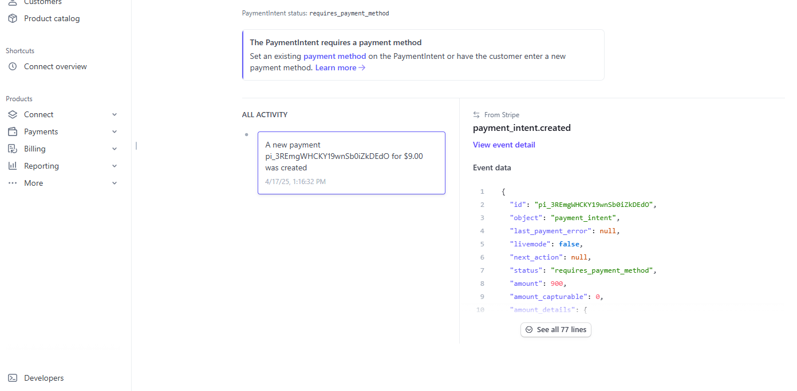

# 🔐 Secure Auth & Payment REST API

A secure and scalable REST API built using **Node.js**, **Express.js**, **Passport.js**, **JWT**, and **Stripe**, featuring user authentication, role-based access control, and payment processing.

---

## 🚀 Features

- User registration & login
- Secure JWT-based authentication
- Role-based access control (user/admin)
- Payment simulation with Stripe
- Secure password hashing with bcrypt
- Protected routes using JWT middleware
- Error handling and input validation
- Refresh token mechanism
- Rate limiting to prevent brute-force attacks
- Dockerized MongoDB or PostgreSQL database
- Unit tests for authentication

---

## 🛠️ Tech Stack

- **Backend Framework**: Express.js
- **Authentication**: Passport.js, JWT, Bcrypt.js
- **Database**: MongoDB (with Mongoose)
- **Payment Gateway**: Stripe
- **Security**: Rate-limiter
- **Testing**: Jest / Supertest
- **Environment**: Docker (for database)

---

## 📦 Installation

```bash
# Clone the repository
git clone https://github.com/Mahi-markus/secure-restAPI-authentication.git
cd secure-restAPI-authentication
```

# Install dependencies

```bash
npm install
```

# Create .env file and In the env file below thing need to be added:

```bash
PORT=5000
MONGO_URI=mongodb://localhost:27017/secure_api
JWT_SECRET=your_jwt_secret
STRIPE_SECRET=sk_test_51*********your_secret_key
REFRESH_TOKEN_SECRET=my_refresh_token_secret

```

# Opend a terminal and Start the server

```bash
npm start

```

# Initilize the Docker using below command in another terminal

```bash
docker compose up

```

# Herers the below API to test using postman:

```bash
- Post   http://localhost:5000/auth/register
- Post   http://localhost:5000/auth/login
- Get    http://localhost:5000/auth/me
- Post   http://localhost:5000/payments/checkout
- Post   http://localhost:5000/auth/refresh
```

- **\*For Register:Example body is below**

```bash
{
  "email":"mahi1@gmail.com",
  "password":"admin123",
  "role":"user"
}


```

- **\*For login:Example body is below**

```bash

{
  "email": "mahi1@gmail.com",
  "password": "admin12"
}

```

- **\*For checkout:Example body is below after putting token in the "bearer token"**

```bash

{

  "amount":"100",
  "currency": "usd",
  "description": "Sample Product"
}


```

**_TO see the tables and data in the table use the below command_**

```bash
docker exec -it auth-mongo mongosh   or mongosh "if you are having trouble to see the table or data"
show dbs
use secure_api
show collections
db.users.find().pretty()
db.transactions.find().pretty()

```

**\*To run the unit test use the below command**

```bash
npm test
npm run test:coverage
```

**_stripe here_**

